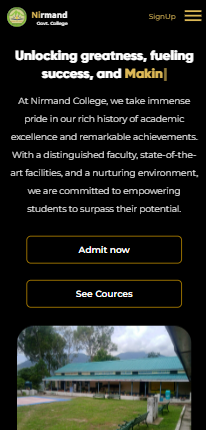

### Project Name: Local Government College Website

---

#### Overview:

This project is an open-source website template designed for local government colleges. It encompasses essential features required for a college website, including information about the college, faculty details, course offerings, an application form for enrollment, notifications, and contact information. While the signup feature is pending implementation due to budget constraints, the project is open for contributions and enhancements.

#### Getting Started:

To deploy the project locally, follow these simple steps:

1. Clone the repository:
   ```
   git clone https://github.com/hitesh911/nirmand-college-website
   ```

2. Install dependencies:
   ```
   npm install
   ```

3. Start the development server:
   ```
   npm start
   ```

The website will be accessible at `http://localhost:3000`.

#### Dependencies:

- **animate.css**: A library for adding animations to web pages.
- **clipboard-copy**: Provides utilities for copying text to the clipboard.
- **filesize**: Library for formatting file sizes.
- **react**: JavaScript library for building user interfaces.
- **react-dom**: React package for DOM manipulation.
- **react-dotenv**: Allows loading environment variables from a `.env` file.
- **react-google-recaptcha**: Integration for Google reCAPTCHA in React applications.
- **react-image-gallery**: Component for creating image galleries in React.
- **react-loading**: Component for displaying loading spinners in React.
- **react-modal**: Library for creating modal dialogs in React.
- **react-notifications**: Component for displaying notifications in React applications.
- **react-read-more-read-less**: Component for creating expandable/collapsible text in React.
- **react-recaptcha-google**: Google reCAPTCHA component for React.
- **react-router-dom**: React package for routing in web applications.
- **react-scripts**: Scripts and configurations used by Create React App.
- **react-ui-cards**: UI component library for creating cards in React.
- **typewriter-effect**: Library for creating typewriter-like text effects.
- **web-vitals**: Library for measuring web performance metrics.

#### Code Structure:

The project follows a maintainable and scalable code structure with clear separation of concerns. The components are organized in a modular way, promoting reusability and easy maintenance. Key directories include:

- **components**: Contains reusable UI components.
- **pages**: Defines different pages of the website.
- **utils**: Houses utility functions and helper methods.
- **styles**: Contains global styles and theme configurations.

#### Screenshots:

1. 

---

2. 

---

3. 

---

4. 

---

5. 

---

6. 

---

7. 

---

8. 


#### Contributions:

Contributions to the project are welcome. Feel free to fork the repository, make enhancements or fixes, and submit pull requests. Please adhere to the existing code style and guidelines.

#### License:

This project is licensed under the [MIT License](LICENSE).
